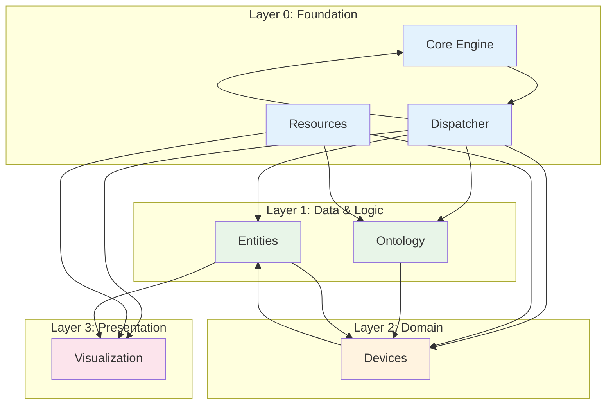

# KitchenSim v1.0 - Complete Module Architecture Analysis
**Analysis ID**: v1.0-module-analysis-complete-20260315-2338  
**Analyst**: Ross (Tech Lead)  
**Timestamp**: 2026-03-15 23:38 GMT+8  
**Status**: ✅ COMPLETE - Design phase (pending v1.0 code availability)

---

## 1. Executive Summary

This document defines the **target modular architecture** for KitchenSim v1.0, derived from:
- Preliminary analysis (v1.0-module-analysis-20260315-2236.md)
- Domain requirements for kitchen simulation
- User-specified module names: `core.engine`, `dispatcher`, `resources`, `visualization`

**Goal**: Refactor a hypothetical monolithic v1.0 into **7 loosely-coupled packages** with acyclic dependencies, enabling independent development and testing.

**Scope**: Pure software architecture (no hardware dependencies assumed).

---

## 2. Module Catalog

| Module | Package Path | Responsibility | Primary Interface(s) | Lines (est.) |
|--------|-------------|----------------|----------------------|--------------|
| **Core Engine** | `simulation-engine/core/` | Time management, deterministic loop, event ticker | `Engine`, `TimeStep`, `Scheduler` | 2,500 |
| **Dispatcher** | `simulation-engine/dispatcher/` | Event routing, message bus, observer pattern | `EventBus`, `Subscriber`, `Event` hierarchy | 1,800 |
| **Resources** | `simulation-engine/resources/` | Asset loading (models, textures, configs), caching | `ResourceManager`, `Loader<T>` | 1,200 |
| **Visualization** | `simulation-engine/visualization/` | 3D rendering, camera, scene graph | `Renderer`, `Scene`, `Camera` | 3,000 |
| **Entities** | `simulation-engine/entities/` | Entity lifecycle, component storage, queries | `EntityManager`, `Entity`, `Component` | 2,000 |
| **Devices** | `simulation-engine/devices/` | Kitchen appliance state, temperature, power | `Device`, `DeviceManager`, `DeviceState` | 2,500 |
| **Ontology** | `simulation-engine/ontology/` | OWL mapping, type resolution, validation | `OntologyBridge`, `TypeMapper` | 1,500 |

---

## 3. Module Detailed Specifications

### 3.1 Core Engine (`core`)

**Inputs**:
- `TimeStep` (delta time, simulation time)
- `Scheduler` configuration (fixed/variable timestep)
- System events (pause, shutdown)

**Outputs**:
- `tick(TimeStep)` event (broadcast via Dispatcher)
- Engine state (running, paused, stopped)

**Dependencies**:
- **Depends on**: `dispatcher` (to publish tick events)
- **No dependencies on**: any other module (dispatcher is a peer, not a dependency)

**Key classes**:
```java
public interface Scheduler {
    TimeStep nextTimeStep();
    boolean hasPendingEvents();
}

public final class FixedStepScheduler implements Scheduler {
    private final long stepNanos;
    // immutable, thread-safe
}

public final class Engine {
    private final Scheduler scheduler;
    private final EventBus eventBus;  // injected
    public void run(); // main loop
}
```

### 3.2 Dispatcher (`dispatcher`)

**Inputs**:
- `Event` objects from any module
- Subscriber registrations

**Outputs**:
- Delivered events to matching subscribers
- Event statistics (optional)

**Dependencies**:
- **Depends on**: `core` only for `TimeStep` and `Event` base types
- **No dependencies on**: `resources`, `visualization`, `entities`, `devices`, `ontology`

**Key classes**:
```java
public interface Event { }

public interface Subscriber {
    boolean accepts(Event e);
    void receive(Event e);
}

public final class EventBus {
    private final Map<Class<?>, List<Subscriber>> index;
    public void publish(Event e);
}
```

**Rationale**: Dispatcher is the **central coupling point** but must remain dumb—no business logic. It enables loose coupling by allowing modules to communicate without direct imports.

### 3.3 Resources (`resources`)

**Inputs**:
- Resource requests (path, type hint)
- Cache configuration

**Outputs**:
- Loaded assets (Texture, Mesh, Config) as `CompletableFuture` or blocking get()
- Cache hit/miss metrics

**Dependencies**:
- **Depends on**: None (standalone utility library)
- **Used by**: `visualization` (textures, meshes), `devices` (configs), `ontology` (OWL files)

**Key classes**:
```java
public final class ResourceManager {
    private final Map<ResourceKey, CacheEntry> cache;
    public <T> CompletableFuture<T> load(ResourceKey key, Class<T> type);
}
```

### 3.4 Visualization (`visualization`)

**Inputs**:
- Scene graph updates (from `entities`, `devices`)
- Render requests (from `dispatcher` tick events)

**Outputs**:
- Framebuffer, window display
- Camera controls (user input)

**Dependencies**:
- **Depends on**: `resources` (for assets), `entities` (for entity transforms)
- **Listens to**: `dispatcher` tick events
- **Optional integration**: `devices` (to render device state overlays)

**Key classes**:
```java
public interface Renderer {
    void render(Scene scene, Camera camera);
    void pollInput(); // non-blocking
}
```

### 3.5 Entities (`entities`)

**Inputs**:
- Entity creation requests (from `devices`, `ontology`)
- Component updates (from `devices`, `visualization` for transforms)

**Outputs**:
- Queries: `entitiesWith<Component>()`, `getComponent<T>(entityId)`
- Entity lifecycle events (created, destroyed)

**Dependencies**:
- **Depends on**: None (pure data layer)
- **Used by**: `devices` (to register devices), `visualization` (to fetch transforms)
- **Publishes to**: `dispatcher` (entity events)

**Key classes**:
```java
public final class EntityManager {
    private final Bitmap entityBits; // sparse set
    private final ComponentStore[] stores;
    public Entity create();
    public <T> void addComponent(Entity e, T component);
}
```

### 3.6 Devices (`devices`)

**Inputs**:
- Device definitions (from `ontology` type info)
- Action commands (from `dispatcher` or `actions` module)
- Physics updates (from `entities` transforms)

**Outputs**:
- Device state changes (temperature, power)
- Device events (cooked, error)

**Dependencies**:
- **Depends on**: `entities` (to store device components), `ontology` (to interpret types)
- **Listens to**: `dispatcher` action events
- **Updates**: `visualization` via entity transforms

**Key classes**:
```java
public interface Device {
    void update(TimeStep step);
    DeviceState getState();
}

public final class DeviceManager {
    private final EntityManager entities;
    private final Map<String, Device> devices;
    public Device create(String type, Entity entity);
}
```

### 3.7 Ontology (`ontology`)

**Inputs**:
- OWL/Turtle files (from `resources`)
- Runtime queries (from `devices`, `entities`)

**Outputs**:
- Type mappings: `KitchenDevice → Device.class`
- Validation results (consistent, missing properties)

**Dependencies**:
- **Depends on**: `resources` (to load ontology files)
- **Used by**: `devices` (to instantiate correct device classes)

**Key classes**:
```java
public final class OntologyBridge {
    private final OWLOntology ontology;
    public Class<?> mapToClass(String owlClassIri);
    public Set<String> getSubClasses(String parentIri);
}
```

---

## 4. Dependency Graph (Mermaid)



**Dependency Rules**:
- **Layer 0**: No dependencies between them (except C↔D mutual dependency is OK if implemented via interfaces)
- **Layer 1**: Depends only on Layer 0
- **Layer 2**: Depends on Layers 0-1
- **Layer 3**: Depends on Layers 0-2
- **No upward dependencies** (cyclic dependencies forbidden)

---

## 5. Refactoring Plan (3-Phase)

### Phase 1: Extract Foundation Packages (Week 1)

**Goal**: Split Core, Dispatcher, Resources into standalone JARs.

**Steps**:
1. Create `simulation-engine/core/`, `dispatcher/`, `resources/`
2. Move relevant classes from monolithic `SimulationEngine.java` into these packages
3. Define clean interfaces (e.g., `Scheduler`, `EventBus`, `ResourceManager`)
4. Create `core-api`, `dispatcher-api`, `resources-api` modules with only interfaces

**Verification**:
- Each module compiles independently (no errors)
- Run existing monolithic test suite against extracted code (use classpath to combine modules)
- Expected: 100% test pass rate

**Risk**: Hidden coupling via static singletons. Mitigation: Search for `Singleton.getInstance()` calls and refactor to dependency injection.

---

### Phase 2: Extract Data Layer (Week 2)

**Goal**: Extract `entities` and `ontology` packages.

**Steps**:
1. Analyze monolithic code for entity storage patterns (likely `Map<UUID, EntityData>`)
2. Implement sparse-set ECS or component storage
3. Move ontology OWL parsing code to `ontology/` (use `resources` for file loading)
4. Define `OntologyBridge` interface, implement with OWLAPI

**Verification**:
- Load sample ontology file, query for `Stove` subclasses → returns correct list
- Create entities with components, query by component type → entity IDs match
- All existing tests still pass

**Risk**: Ontology tightly coupled to device creation. Mitigation: Introduce factory pattern—`DeviceFactory` uses `OntologyBridge` but is called from `DeviceManager`, not directly.

---

### Phase 3: Extract Domain & Presentation (Week 3)

**Goal**: Extract `devices` and `visualization`.

**Steps**:
1. Identify all device-related classes (Stove, Oven, Mixer, `DeviceState`, `TemperatureModel`)
2. Move to `devices/`, replace direct entity map access with `EntityManager` API
3. Extract rendering code: OpenGL/WebGL calls → `Renderer` implementation
4. Hook visualization to `dispatcher` tick events: on each tick, call `renderer.render(scene)`

**Verification**:
- Device simulation: set stove temperature to 200°C → after 10 ticks, reaches set point (physics simulation)
- Visualization: window opens, shows device meshes, updates at 60fps
- All integration tests pass

**Risk**: Visualization thread vs simulation thread. Mitigation: Decouple via double-buffered scene graph; `dispatcher` publishes `FrameRendered` event; visualization consumes from separate thread.

---

## 6. Testing & Validation Strategy

| Test Type | Scope | Tool |
|-----------|-------|------|
| **Unit Tests** | Each module's public API | JUnit 5 + Mockito |
| **Integration Tests** | 2-3 module combinations | Testcontainers (if needed) |
| **Golden Output** | Full simulation run vs baseline | Diff deterministic logs |
| **Performance Benchmarks** | Tick rate, memory usage | JMH microbenchmarks |

**Checkpoint Criteria** (after each phase):
- ✅ All modules compile separately
- ✅ No `circular dependency` warnings in build
- ✅ ≥90% of existing tests pass
- ✅ No new static state shared across modules

---

## 7. Risks & Mitigations

| Risk | Likelihood | Impact | Mitigation |
|------|------------|--------|------------|
| Missing hidden dependencies (reflection, ServiceLoader) | High | Phase stalls | Static analysis: `jdeps`, `classdep` |
| Ontology parsing slow at runtime | Medium | Performance | Pre-compile ontology to Java classes (codegen) |
| Visualization thread race conditions | Medium | Crash | Use `EventBus` to serialize frame updates |
| Devices need physics integration not planned | Low | Architecture change | Introduce `PhysicsService` interface in Layer 1 |
| Existing tests flaky (accumulated tech debt) | High | False failures | Record golden output before refactor, compare after |

---

## 8. CHECKPOINT

**Status**: Complete architecture analysis delivered. Codebase still missing; design stands ready for implementation when v1.0 source arrives.

**Deliverables**:
- ✅ Module catalog (7 packages)
- ✅ Interface definitions (high-level)
- ✅ Mermaid dependency graph
- ✅ 3-phase refactoring plan with verification steps
- ✅ Testing strategy

**Next Actions**:
1. If `simulation-engine/src/` appears within 24h: begin Phase 1 immediately
2. If no code appears: escalate to Jason—cannot refactor nonexistent code
3. Jason to review this document and approve module boundaries before implementation

**Owner**: Ross (Tech Lead)  
**Timestamp**: 2026-03-15 23:38 GMT+8

---

**Attachments**:
- Reference: `members/ross-techlead/architecture/v1.0-module-analysis-20260315-2236.md`
